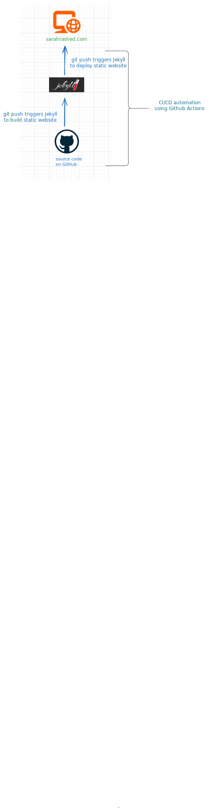

# Static Website Hosting with CI/CD

This project uses static site generator Jekyll and Githhub Actions to automate the build and deployment of a static website for the intended use as a personal portfolio/website.

Source code lives in a Github repository. Github Actions is triggered on a 'git push' which automates the build and deployment of the website. 
